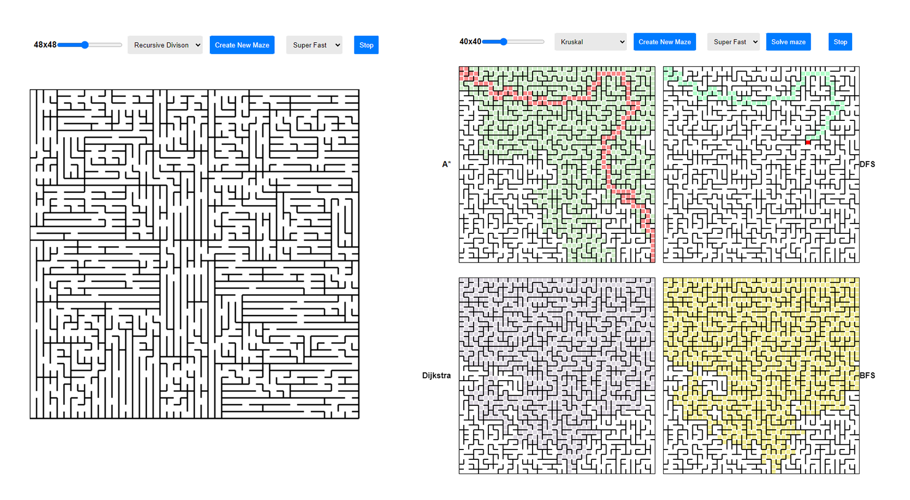

# About

Maze generation/solving visualizer 

Generate mazes of various sizes using six different algorithms:

- DFS
- Prim's
- Kruskal's
- Recursive Division
- Binary Tree
- Sidewinder

Solve them using four:

- A* pathfinding
- DFS
- Dijkstra's
- BFS

# Setup

Clone the repository

```
$ git clone https://github.com/Koki131/maze-algorithms-visualizer.git
```

Run the app 

```
$ npm run build
```
OR
```
$ npm start
```

### Live demo

https://maze-visualizer.netlify.app

### Preview




